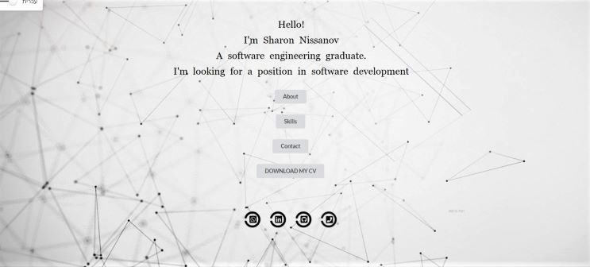

# **Contact Website**
## Live preview: https://porfolio-d170d.web.app/

This is my first responsive website that I have developed using: \
⚡️ ReactJS, EmailJS and more. ⚡️ \
The purpose of this website was to serve as an easy and simple way to contact me at the beginning of my job search process. \
On this website you can: 
👍 Read a bit about me and my skills. \
👍 Download My resume. \
👍 Contact me via mail, linkedin and phone. \
👍 Get all the information you need in English and Hebrew. 



### Setup & Run
- Clone or download this repository https://github.com/sharonNissanov/Contact-Website
- Install dependencies: in cmd run ```npm install``` 
- Run the app in the development mode: in cmd run ```npm start```\
Open [http://localhost:3000](http://localhost:3000) to view it in the browser.\
The page will reload if you make edits.\
You will also see any lint errors in the console. 

Enjoy 😊